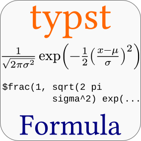

# typst_formula

**typst_formula** is an Inkscape extension for inserting [typst](https://typst.app/) generated formulas into your SVG document.

## Context
Typst is a markdown-based typesetting system comparable to LaTeX but much easier to learn. This extension renders typst code to svg and inserts it into your Inkscape document.

## Notes

- This extension will be part of Inkscape by default, most likely starting with Inkscape 1.4 ([Link to the repositories of Inkscape stock extensions](https://gitlab.com/inkscape/extensions/-/merge_requests/606)). Until then you need to install it as described below.

- This extension just inserts a formula into your document. If you need to edit your formulas try the TexText extension, which also supports typst: https://github.com/textext/textext

## Installation instructions (2 possibilities):

### A) Installation via Inkscape's Extension Manager

1. Download the zip file

2. Launch Inkscape and open `Extensions` - `Manage Extensions...`

3. Select `Install Packages` and then click on the disk button

4. Select the downloaded zip file and close the extension manager.

5. Restart Inkscape. You will find the extension under `Extensions`- `Text` - `Typst Formula...`

### B) Manual installation

1. Download the zip file

2. Extract its content into

    - Linux, Mac: ~/.config/inkscape/extensions
    - Windows: C:\Users\AppData\Roaming\inkscape\extensions

3. Restart Inkscape. You will find the extension under `Extensions`- `Text` - `Typst Formula...`